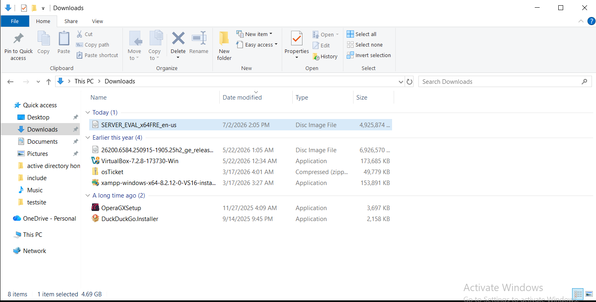
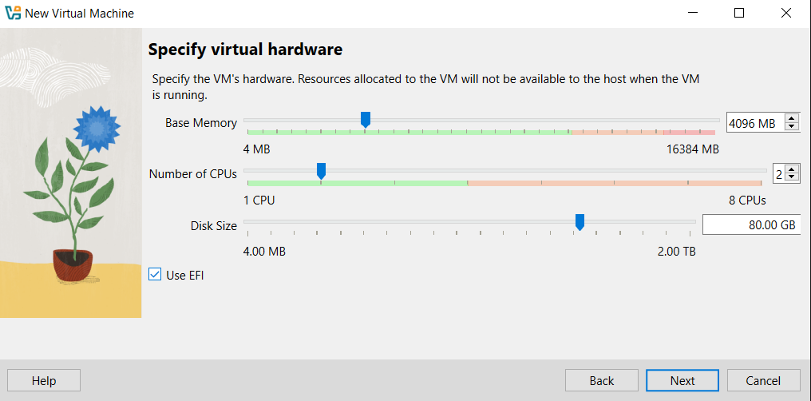
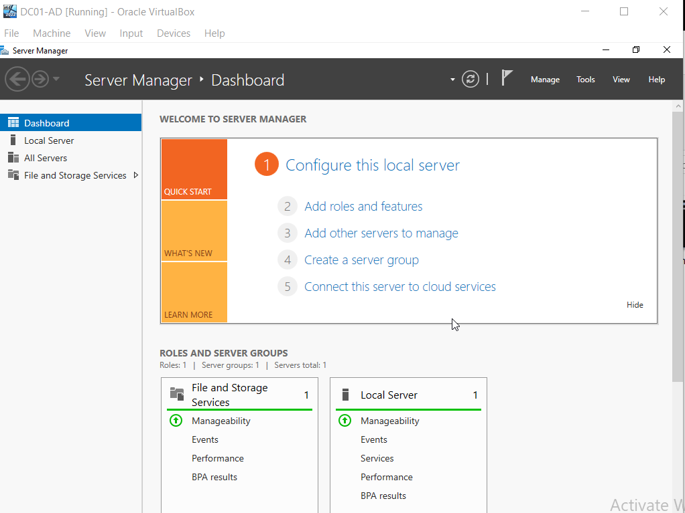
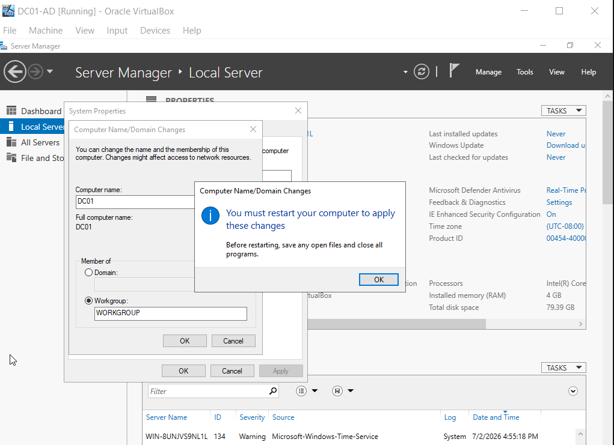
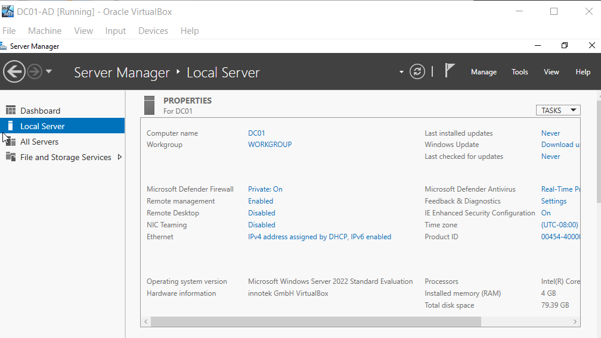

# Active Directory Home Lab

## Project Overview

This project documents the deployment and configuration of a Windows Server 2022 Active Directory Home Lab built in Oracle VirtualBox. The lab demonstrates common Help Desk and System Administrator tasks performed in an enterprise environment.

## Technologies Used

- Windows Server 2022
- Active Directory Domain Services (AD DS)
- DNS
- Oracle VirtualBox
- Windows 11 Client
- GitHub

## Skills Demonstrated

- Installing Windows Server 2022
- Promoting a Domain Controller
- Configuring Active Directory
- Creating Organizational Units (OUs)
- Creating User Accounts
- Managing Security Groups
- Password Resets
- User Account Unlocks
- Group Membership Management
- Basic Help Desk Administration

## Project Goals

- Build a functioning Active Directory environment
- Simulate real-world Help Desk tasks
- Gain hands-on Windows Server experience
- Document the project for employers

## Lab Screenshots
# Phase 1 – Windows Server 2022 Installation

## Step 1 – Create the Windows Server Virtual Machine

Downloaded the official Windows Server 2022 Evaluation ISO from Microsoft. This ISO will be used to create the D01 domain controller virtual machine for the Active Directory home lab
.

---

## Step 2 – Install Windows Server 2022

Created the D01 virtual machine and attached the official Windows Server 2022 Evaluation ISO in Oracle VirtualBox

---

## Step 3 – Initial Server Setup

Configured the virtual hardware for the DC01 Windows Server virtual machine (4 GB RAM, 2 CPUs, 80 GB virtual disk)

---

## Step 4 – Configure the Server

Configured the Microsoft OS setup

---

## Step 5 – Prepare the Server

After completing the installation, created a password under the administrator.

---

## Step 6 – Server Manager

administrator login screen

---

## Step 7 – Windows Server Ready

Successfully logged into the newly installed Windows Server 2022 virtual machine for the first time.

---

## Step 8 – Final Configuration

Renamed the Windows Server host from its automatically generated name to DC01

---

## Step 9 – Windows Server Complete

Windows Server 2022 installation successfully completed and ready for Active Directory deployment.
