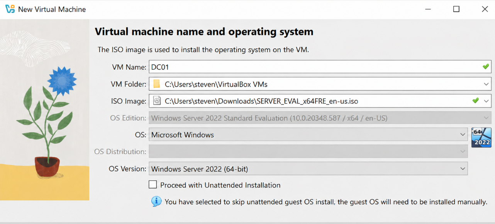
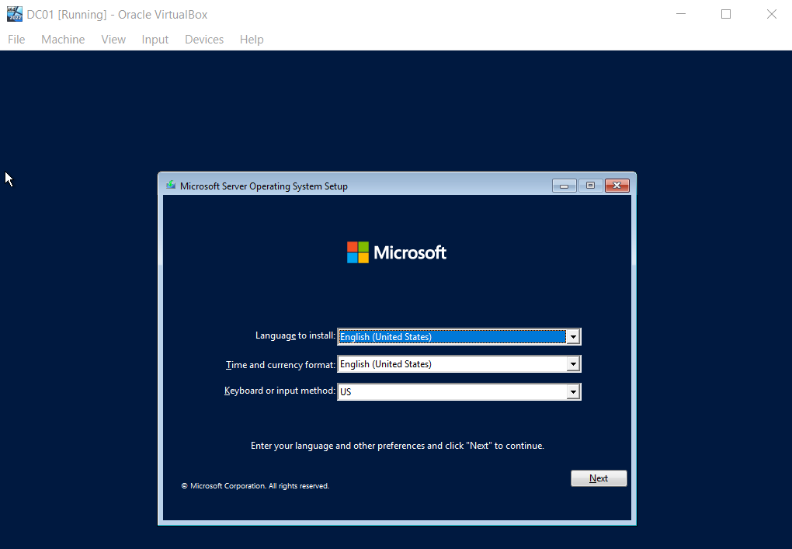
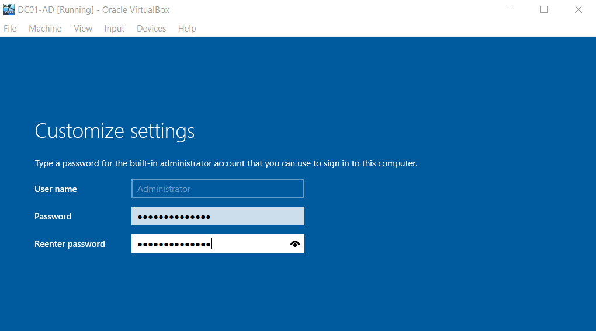
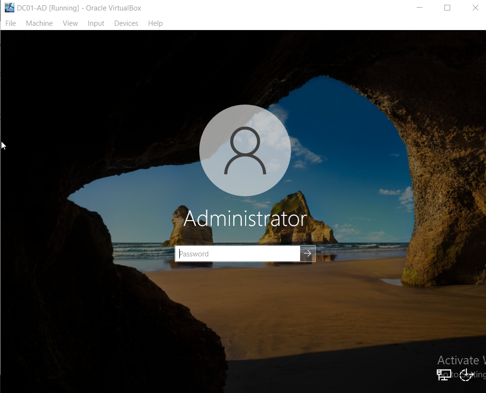

# Active Directory Home Lab

## Project Overview

This project documents the deployment and configuration of a Windows Server 2022 Active Directory Home Lab built in Oracle VirtualBox. The lab demonstrates common Help Desk and System Administrator tasks performed in an enterprise environment.

## Technologies Used

- Windows Server 2022
- Active Directory Domain Services (AD DS)
- DNS
- Oracle VirtualBox
- Windows 11 Client
- GitHub

## Skills Demonstrated

- Installing Windows Server 2022
- Promoting a Domain Controller
- Configuring Active Directory
- Creating Organizational Units (OUs)
- Creating User Accounts
- Managing Security Groups
- Password Resets
- User Account Unlocks
- Group Membership Management
- Basic Help Desk Administration

## Project Goals

- Build a functioning Active Directory environment
- Simulate real-world Help Desk tasks
- Gain hands-on Windows Server experience
- Document the project for employers

## Lab Screenshots
# Windows Server 2022 Installation

## Screenshot 1 – Windows Server Installation

## Screenshot 2 – Server Installation Progress

## Screenshot 3 – Initial Server Configuration

## Screenshot 4 – Preparing the Server

## Screenshot 5 – Server Configuration

## Screenshot 6 – Server Manager

## Screenshot 7 – Server Ready for Role Installation

## Screenshot 8 – Final Configuration

## Screenshot 9 – Windows Server Completed

## Lab Walkthrough

### Screenshot 1 – Windows Server 2022 Installed

Description:
Successfully installed Windows Server 2022 in Oracle VirtualBox. This virtual machine will serve as the Domain Controller (DC01) for the Active Directory environment.

